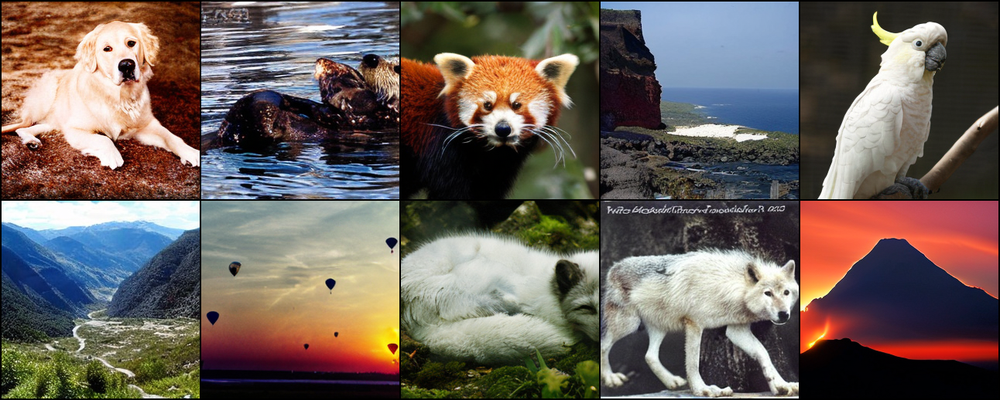
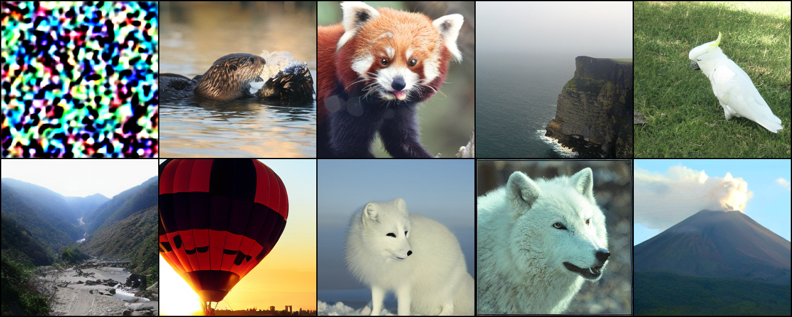

# **S**aliency **F**orgetting in the **R**emain-preserving manifold **on**line for **DiT**

This is the official implementation for SFR-on on ImageNet using DiT. The code is based on the [DiT](https://github.com/facebookresearch/DiT) official implementation.

<table align="center">
  <tr>
    <td align="center"> 
       
      <br>
      <em style="font-size: 18px;">  <strong style="font-size: 18px;">Figure 1:</strong> Samples from the original DiT-XL-2-256x256.</em>
    </td>
  </tr>
</table>

<table align="center">
  <tr>
    <td align="center"> 
       
      <br>
      <em style="font-size: 18px;">  <strong style="font-size: 18px;">Figure 2:</strong> Samples from the unlearned DiT. We successly remove the knowledge of <strong style="font-size: 18px;">Golden retriever</strong>, while preserving the knowledge of other classes.</em>
    </td>
  </tr>
</table>


# Requirements

Install the requirements using a conda environment:

```bash
conda env create -f environment.yml
conda activate DiT
```

# Preparing for Unlearning

1. Dataset ImageNet: You should download the ImageNet dataset and place it at `data_path`.
2. Pre-trained DiT checkpoints: You can either download the pre-trained DiT model ([XL-2-256x256](https://dl.fbaipublicfiles.com/DiT/models/DiT-XL-2-256x256.pt) in the paper) on advance, or the weights for the pre-trained DiT model will be automatically downloaded depending on the model you use.

# Forgetting with SFR-on
1. First, we need to generate fisher diagonal for saliency map. 
```bash
python generate_fisher.py --model DiT-XL/2 --data-path $data_path --batch-size $bz --ckpt $ckpt --n-iters $iters --forget-class $cls --mask-path $mask_path
```
* data_path: path to the imagenet dataset.
* bz: batch size. (default: 1, can be increased for better results but costs more memory)
* ckpt: path to the pre-trained DiT checkpoint.
* iters: number of iterations to generate the fisher diagonal. (default: 2000, can be increased for better results but costs more time)
* cls: the class to be forgotten. (such as: 207)
* mask_path: path to the saliency mask. (default: ./mask)

2. Next, we need to generate saliency map with threshold ($\gamma$ in paper) for unlearning. 
```bash
python generate_mask.py --mask-path $mask_path --forget-class $cls --thresholds $thresholds 
```
* mask_path: path to the saliency mask. (default: ./mask)
* cls: the class to be forgotten. (such as: 207)
* thresholds: a list of threshold values to apply for hard-coding the mask. (default: "0.5 1 3 5 10")

3. Forgetting training with SFR-on.
```bash
python forget.py --model DiT-XL/2 --data-path $d --batch-size $bz --ckpt $ckpt --n-iters 600 --snapshot-every 50 --lr 1e-4 --forget-class $cls --method ron --unlearn-loss ga \
    --forget-alpha 1e-3 --decay-forget-alpha --remain-alpha 1.0 --mask-path $mask_path
```
* d: path to the imagenet dataset.
* bz: batch size. (default: 1, can be increased for better results but costs more memory)
* ckpt: path to the pre-trained DiT checkpoint.
* n-iters: number of iterations for unlearning. (recommended range: 500 to 1000)
* snapshot-every: interval at which to visualize results. (default: 50)
* lr: learning rate. (default: 1e-4)
* forget-class: the class to be forgotten. (such as: 207)
* method: the method to generate the saliency map. (default: ron)
* unlearn-loss: the loss function to use for unlearning. (default: ga)